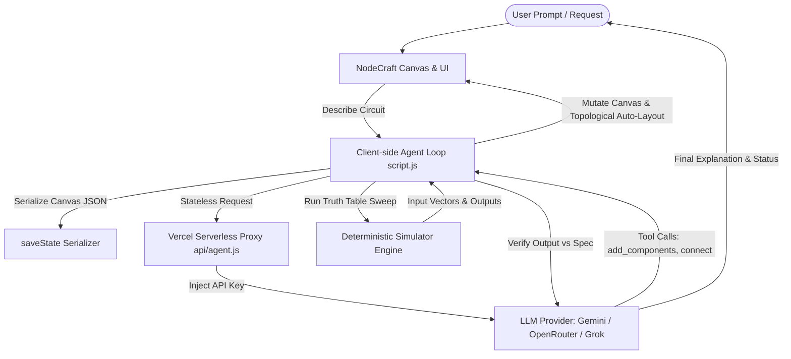
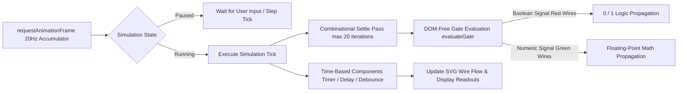
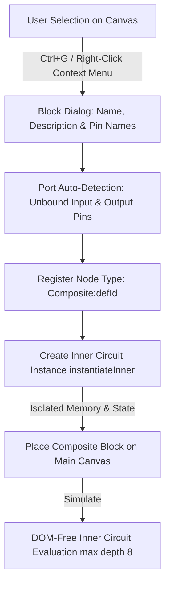

<h1 align="center" style="font-size:56px;margin:18px 0;color:#0a84ff;text-shadow:0 2px 8px rgba(10,132,255,0.16);">
  NodeCraft
</h1>

  <strong>Build logic circuits the way you would build with blocks.</strong> 
  A browser-based digital logic simulator with a Stormworks-inspired workshop feel &mdash; featuring an AI assistant that builds, tests, and self-verifies circuits alongside you.

  <a href="https://nodecraft-plum.vercel.app/"><strong>&#9654; Open Live App on Vercel</strong></a>
  &nbsp;&middot;&nbsp;
  <a href="#what-is-nodecraft">Overview</a>
  &nbsp;&middot;&nbsp;
  <a href="#architecture--flow-charts">Architecture & Flow Charts</a>
  &nbsp;&middot;&nbsp;
  <a href="#features--capabilities">Features</a>

---

## Live Deployment

Experience NodeCraft directly in your browser without any installation, setup, or local server commands:

**🚀 [https://nodecraft-plum.vercel.app/](https://nodecraft-plum.vercel.app/)**

---

## What is NodeCraft

NodeCraft turns digital logic into an intuitive, interactive experience. Drag logic gates onto an infinite canvas, connect them with color-coded wires, flip a switch, and watch signals flow in real time. Red wires carry boolean logic signals (ON/OFF), green wires carry floating-point numerical values, and the entire simulation updates live as you build.

Designed for learners, educators, and hardware enthusiasts, NodeCraft scales from elementary logic gates up to complex computer components:
- **Build & Wire:** Mix logic gates, arithmetic blocks, flip-flops, memory registers, custom function gates, and visual displays (dials, bar graphs, lamps).
- **Composite Sub-Circuits:** Group any working selection (`Ctrl+G`) into a custom, reusable chip with isolated internal state. Nest chips inside other chips to build adders, multiplexers, or full ALUs.
- **AI Assistant:** Describe a circuit in plain text and watch the assistant build it step-by-step on the canvas, topological layout included. The assistant tests its own work against the deterministic simulator via truth-table sweeps before confirming completion.
- **Cloud Microcontroller Manager:** Save circuits to the cloud with hand-drawn canvas thumbnails and descriptions, and access them across devices.

---

## Architecture & Flow Charts

### 1. AI Assistant Build-Test-Fix Loop

The AI assistant loop runs directly inside the client browser context. Canvas state is serialized as JSON (`saveState()`), eliminating vision overhead. A serverless proxy (`api/agent.js`) validates user sessions and injects API keys, while spatial layout is calculated deterministically using topological depth sorting (`layoutCircuit()`).

---

### 2. Fixed-Rate Simulation Tick & Dual-Signal Engine

NodeCraft features a 20 Hz fixed-rate simulation tick driven by `requestAnimationFrame` with catch-up debt capping. Logic propagation handles dual-signal types (Boolean and Floating-Point numeric) across up to 20 combinational settle passes per tick. Time-based components (`Timer`, `Delay`, `Debounce`) advance strictly once per simulation tick.

---

### 3. Composite Sub-Circuit Lifecycle

Select any sub-circuit on the canvas and press `Ctrl+G` to encapsulate it into a custom reusable block. NodeCraft automatically identifies unbound internal pins as block inputs/outputs and registers a dynamic node type (`Composite:<defId>`). Each block instance runs its own isolated inner memory state.

---

## Features & Capabilities

### Core Logic & Components
- **Logic Gates:** AND, OR, NOT, XOR, NAND, NOR, XNOR, Buffer, Tri-State, Threshold, Numerical Switchbox.
- **Arithmetic & Math:** ADD, SUB, MUL, DIV, MOD, POW, SQRT, ABS, NEG, MIN, MAX, CLAMP, ROUND, FLOOR, CEIL, Equal, Greater Than, Less Than.
- **Programmable Function Gate:** Enter custom formulas (e.g., `x * 2 + 1`) to compute math signals dynamically.
- **Memory & Storage:** SR Latch, D Flip-Flop, JK Flip-Flop, T Flip-Flop, Memory Register, Counter, Up/Down Counter, Timer.
- **Signal & Timing:** Free-running Clock generator with configurable period, Delay (N ticks), Pulse (rising edge), Debounce, Random generator.
- **Inputs & Displays:** Interactive Switches, Levers (Direct/Curve modes with min/max bounds), Constant sources, Lights, Digital Dials, Bar Graphs.

### Workspace & UX Design
- **Stormworks Design System:** Dark industrial UI palette, chunky inset-shadow controls, and responsive layout.
- **Infinite Canvas & Navigation:** Pan with middle-mouse/trackpad, pinch-to-zoom (0.25x–3.0x), and HiDPI minimap with live viewport indicator.
- **Clipboard & Context Menu:** Copy, cut, paste (`Ctrl+C / X / V`) with internal wire preservation, duplicate (`Ctrl+D`), and full `Ctrl+Z / Y` undo/redo.
- **Right-Click Context Menu:** Group/ungroup blocks, block details, copy/cut/paste/duplicate, and canvas selection controls.
- **TAB Menu & Search:** Staggered animated component menu with live search bar and hover tooltips detailing component summaries.
- **Session Safety:** Unsaved changes protection dialog and localStorage persistence for Zoom, Pan, Snap-to-Grid, and Dark Mode settings.
- **Supabase Cloud Sync & Authentication:** Google OAuth & Email/Password login, account dashboard for profile management, and cloud microcontroller manager with a built-in 130x130 thumbnail paint canvas.

---

## Keyboard Shortcuts

| Shortcut | Action |
| :--- | :--- |
| `TAB` | Open / close component library menu |
| `Esc` | Close menus, sidebar, settings, or exit Delete Mode |
| `1` – `0` | Quick Access Bar slots |
| `Ctrl / Cmd + C` | Copy selected components & internal wiring |
| `Ctrl / Cmd + X` | Cut selected components |
| `Ctrl / Cmd + V` | Paste components under cursor |
| `Ctrl / Cmd + D` | Duplicate selection in place |
| `Ctrl / Cmd + G` | Group selection into a Composite Block |
| `Ctrl / Cmd + Shift + G` | Ungroup selected Composite Block |
| `Ctrl / Cmd + Z` | Undo last action |
| `Ctrl / Cmd + Y` / `Shift + Ctrl + Z` | Redo action |
| `Delete` / `Backspace` | Delete selected components or wires |
| `Double-Click Node` | Open configuration sidebar |

---

## AI Assistant Configuration

The AI Assistant can be configured in Vercel environment variables:

| Environment Variable | Description | Default / Example |
| :--- | :--- | :--- |
| `AGENT_PROVIDER` | LLM Provider (`openrouter`, `gemini`, `grok`) | `gemini` |
| `AGENT_API_KEY` | Provider API key | `your-api-key` |
| `AGENT_MODEL` | Provider model identifier | `gemini-flash-latest` |
| `AGENT_REQUIRE_AUTH` | Require authenticated Supabase session (`1` or `0`) | `0` |

---

## License

NodeCraft is open source software. Feel free to explore, build upon, and contribute!
